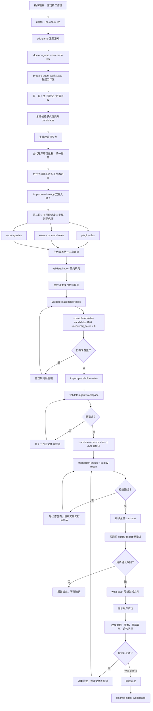

# A.T.T MZ

面向 RPG Maker MZ 日文游戏的自动汉化与迭代修复工具。

> **不会配环境？不会编译 Rust 扩展？** 直接把本项目地址贴给 AI Agent（Claude Code、Codex 等），对它说“帮我用这个项目汉化游戏”。Agent 会按本项目的 Skill 协议检查环境、注册游戏、分析控制符和术语、调用模型翻译、跑质量检查、手动补译，并生成第一版可试玩汉化结果。你只需要提供游戏目录、模型地址和 API Key，之后通过试玩反馈继续查缺补漏。

进阶命令、Agent 协议和工作区细节见 [进阶使用技术文档](docs/advanced-usage.md)。

## 你需要准备

| 项目 | 说明 |
|------|------|
| [Python](https://www.python.org/downloads/) | 3.14 或更高版本 |
| [uv](https://docs.astral.sh/uv/getting-started/installation/) | Python 依赖与环境管理 |
| [Rust](https://rustup.rs/) | MSVC 工具链（`rustup default stable-msvc`） |
| [VS Build Tools](https://visualstudio.microsoft.com/downloads/#build-tools-for-visual-studio-2022) | C++ 桌面开发组件（Rust 扩展编译需要 MSVC 链接器） |
| AI Agent | Claude Code / Codex 等能读取项目文件并运行终端命令的工具 |
| 模型服务 | OpenAI 兼容格式的 API 地址与 Key |
| 游戏目录 | RPG Maker MZ 游戏，目录内能看到 `Game.exe`、`data/`、`js/` |

> **建议**：先复制一份游戏目录作为汉化对象，不要直接在唯一原版上操作。

## 快速开始

```powershell
# 1. 克隆项目
git clone <项目仓库地址> <项目目录>
cd <项目目录>

# 2. 安装依赖
uv sync
uv run maturin develop --release

# 3. 生成配置文件
Copy-Item setting.example.toml setting.toml

# 4. 设置模型环境变量
$env:RPG_MAKER_TOOLS_LLM_BASE_URL = "<模型服务地址>"
$env:RPG_MAKER_TOOLS_LLM_API_KEY = "<API_KEY>"

# 5. 设置 UTF-8 编码（Windows 终端必须做）
$OutputEncoding = [System.Text.UTF8Encoding]::new()
[Console]::InputEncoding = [System.Text.UTF8Encoding]::new()
[Console]::OutputEncoding = [System.Text.UTF8Encoding]::new()
$env:PYTHONUTF8 = "1"
$env:PYTHONIOENCODING = "utf-8"
$env:LANG = "C.UTF-8"
$env:LC_ALL = "C.UTF-8"

# 6. 自检环境
uv run python main.py --agent-mode doctor --no-check-llm --json

# 7. 启动 Agent，把游戏目录告诉它
claude --permission-mode bypassPermissions
```

如果第 6 步返回 `status=error`，按错误提示修环境后再继续。

## 首次启动 Agent 时的任务说明

用你熟悉的 Agent 打开 `<项目目录>` 后，提交这份任务说明（把 `<项目目录>`、`<游戏目录>`、`<工作区>` 替换成你自己的路径）：

```text
请使用 <项目目录>/skills/att-mz/SKILL.md 自动汉化这个 RPG Maker MZ 游戏。

项目目录：<项目目录>
游戏目录：<游戏目录>
工作区：<工作区>

目标：
1. 从注册游戏开始，完成规则分析、正文翻译、质量检查、必要补译、第一版写回和试玩反馈迭代。
2. 全程按 Skill 里写明的输入、输出和校验步骤工作，只通过 CLI、工作区 JSON 和游戏目录处理业务数据。
3. 启动任何翻译前，先由主代理拆分术语字段、派发术语候选子代理、等待全部交卷、严审信达雅和译名统一、亲自修改字段译名表和正文术语表并同时导入；然后再开启插件规则、事件指令规则和 data Note 标签规则三类子代理任务；这些文本来源确认后，再由主代理生成、校验、扫描确认全覆盖并导入占位符规则。
4. 先小批量翻译并运行 quality-report，确认没有乱码、占位符风险、超宽行和明显日文残留后，再继续全量翻译。
5. 质量问题优先用 export-quality-fix-template 导出可填写的修复表，再用 import-manual-translations 导入。
6. 如果还有没成功保存译文的文本，用 export-untranslated-translations 导出完整译文表，只填写中文译文行。
7. 不直接修改数据库，不跳过 validate，不在 quality-report 报告错误时把译文写进游戏文件。
8. 执行 write-back 前先向我确认；我确认后再写回游戏目录。
9. 除非我单独明确允许覆盖字体，否则不要添加 --confirm-font-overwrite。
10. 写回完成后告诉我如何启动汉化后的游戏，并提醒我先实际游玩，把漏翻、误翻、显示异常和语气不自然的地方反馈回来。
11. 收到我的试玩反馈后，先整理成修复清单，再定位问题、修译文或补规则、重新运行质量检查，并在我确认后再次写回游戏文件。
```

## 翻译流程概览

Agent 的期望工作流程：主代理运行 CLI、分两轮派发和复核子代理任务、亲自把关术语表译名、把规则保存到项目数据库、确认游戏控制符全覆盖，质量检查通过后向用户请求写回许可，生成第一版可试玩汉化结果，再根据用户试玩反馈继续修复。



## 运行汉化游戏

写回完成后，进入 `<游戏目录>`，启动游戏即可：

```powershell
Start-Process -FilePath "<游戏目录>/Game.exe"
```

认真试玩一段流程，重点看对话、菜单、物品技能说明、任务提示、插件界面、按钮文字和窗口换行。遇到漏翻、误翻、称呼不统一、显示不下、语气不自然或仍有日文的地方，把截图、场景、当前译文和你期望的表达反馈给 Agent。

如果游戏启动后仍显示日文，先重新运行：

```powershell
uv run python main.py --agent-mode quality-report --game <游戏标题> --json
```

若报告里还有没成功保存译文的文本、日文残留、游戏控制符风险或太长的行，按报告继续修复后再写回。

## Rust 扩展与环境

本项目的质量检查、写入前协议预演和部分 data 扫描由 [PyO3](https://pyo3.rs/) Rust 扩展提供。如果 `uv run maturin develop --release` 报缺少链接器，安装 [Visual Studio Build Tools](https://visualstudio.microsoft.com/downloads/#build-tools-for-visual-studio-2022)，勾选"使用 C++ 的桌面开发"组件。

修改 Rust 代码后：

```powershell
cargo test
uv run maturin develop --release
```

Rust 核心默认使用逻辑 CPU 核心数。需要限制占用：

```powershell
$env:ATT_MZ_RUST_THREADS = "<线程数>"
```

## 模型配置

模型地址和 API Key 通过环境变量提供（推荐）：

```powershell
$env:RPG_MAKER_TOOLS_LLM_BASE_URL = "<模型服务地址>"
$env:RPG_MAKER_TOOLS_LLM_API_KEY = "<API_KEY>"
```

如需调整模型名称、超时或传递额外请求参数，编辑 `<项目目录>/setting.toml` 的 `[llm]` 段。例如使用模型的推理功能：

```toml
[llm]
request_body_extra = '''
{
  "reasoning_effort": "high",
  "thinking": {"type": "enabled"}
}
'''
```

当前流程不支持模型流式返回，配置 `stream=true` 或 `stream_options` 会直接报错。

## 字体还原

默认写回只更新游戏文本，不覆盖字体引用。如果你曾确认覆盖字体、现在想按原件还原：

```powershell
uv run python main.py --agent-mode restore-font --game <游戏标题> --json
```

字体还原会对比 `data/*.json` 与 `data_origin/*.json`、`js/plugins.js` 与 `js/plugins_origin.js`，只把候选覆盖字体名替回原件里的实际旧字体引用，不回滚已写入的译文。

## 常见提醒

- **不要在乱码状态下修译文或规则**——先重设 UTF-8，再重跑相关命令。
- **不要手工改数据库**——所有手动填写译文表都走 CLI 导出和导入。
- **不要跳过小批量翻译**——它能提前暴露控制符和规则问题。
- **不确定某个日文专有名词是否该保留时**——使用日文残留例外规则，不要关闭全局检查。
- **不要把第一版写回当成最终完成**——高质量汉化需要试玩反馈和迭代修复。
