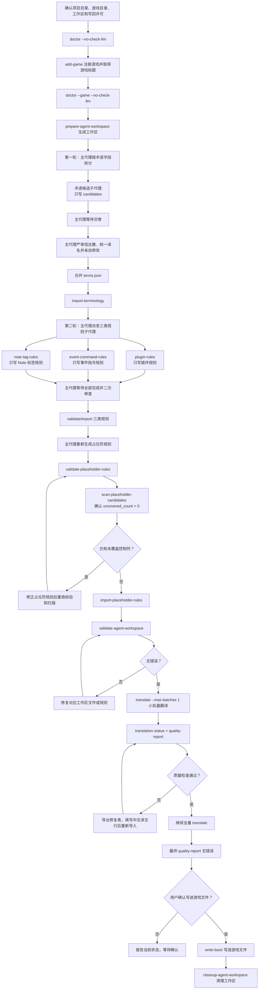

# A.T.T MZ

A.T.T MZ 是面向 RPG Maker MZ 日文游戏的自动汉化工具。新手只需要准备一个游戏目录、一个 OpenAI 兼容模型服务，以及一个能读取项目文件并运行命令的 Agent，例如 Codex、Claude Code 或其他同类工具。Agent 按本项目 Skill 执行流程：分析规则、翻译、检查质量、写回游戏，最后运行汉化后的游戏。

进阶命令、Agent 协议和手动填写译文表的细节见：[进阶使用技术文档](docs/advanced-usage.md)。

## 准备内容

- Windows PowerShell。
- Python 3.14+。
- `uv`。
- 一个能读取本项目文件并运行终端命令的 Agent。
- OpenAI 兼容格式的模型服务地址和 API Key。
- 一个 RPG Maker MZ 游戏目录，目录里通常能看到 `Game.exe`、`data/`、`js/`。

建议先复制一份游戏目录作为汉化对象，避免直接在唯一原版上试跑。

## 1. 拉取项目

```powershell
git clone <本项目仓库地址> <项目目录>
cd <项目目录>
```

安装依赖：

```powershell
uv sync
```

生成本地配置文件：

```powershell
Copy-Item setting.example.toml setting.toml
```

## 2. 设置模型环境变量

在当前 PowerShell 会话里设置模型服务信息：

```powershell
$env:RPG_MAKER_TOOLS_LLM_BASE_URL = "<模型服务地址>"
$env:RPG_MAKER_TOOLS_LLM_API_KEY = "<API_KEY>"
```

如果你的模型服务、模型名称或超时时间需要调整，编辑 `<项目目录>/setting.toml`。

## 3. 让 Agent 能读取 Skill

本项目的 Agent 执行协议在：

```text
<项目目录>/skills/att-mz/SKILL.md
```

如果你的 Agent 支持安装 Skill，就按该 Agent 的安装方式加载 `skills/att-mz`。如果它不支持安装 Skill，也可以在任务说明里明确要求它读取 `<项目目录>/skills/att-mz/SKILL.md`，再按文档里的 CLI 和工作区文件流程执行。

换句话说，A.T.T MZ 不绑定某一个 Agent。Codex 用户按 Codex 的 Skill 使用方式处理，Claude Code 用户可以直接在项目目录里让 Claude Code 读取这份 Skill。

## 4. 启动前设置 UTF-8

友情提示：游戏文本里经常同时包含日文、中文和 RPG Maker 控制符。Windows 终端编码不对时，Agent 可能看到乱码并误判文本。启动 Agent 前，先在同一个 PowerShell 会话里执行：

```powershell
$OutputEncoding = [System.Text.UTF8Encoding]::new()
[Console]::InputEncoding = [System.Text.UTF8Encoding]::new()
[Console]::OutputEncoding = [System.Text.UTF8Encoding]::new()
$env:PYTHONUTF8 = "1"
$env:PYTHONIOENCODING = "utf-8"
$env:LANG = "C.UTF-8"
$env:LC_ALL = "C.UTF-8"
```

然后做一次项目自检：

```powershell
uv run python main.py --agent-mode doctor --no-check-llm --json
```

如果这一步返回 `status=error`，先按错误提示修环境。

## 5. 启动 Agent

使用你熟悉的 Agent 工具打开 `<项目目录>`，并确保它能运行终端命令。下面仅以 Claude Code 为例：

```powershell
claude --permission-mode bypassPermissions
```

如果使用 Codex 或其他 Agent，按对应工具的方式打开这个项目，然后提交同一份任务说明即可。把 `<游戏目录>` 和 `<工作区>` 换成你自己的目录；`<工作区>` 建议放在游戏目录旁边或游戏目录内的临时文件夹。

Agent 的期望工作流程如下：主代理负责运行 CLI、分两轮派发和复核子代理任务、亲自把关术语表译名、把规则保存到项目数据库、确认游戏控制符全覆盖，并在质量检查通过后向用户请求写回许可。



```text
请使用 <项目目录>/skills/att-mz/SKILL.md 自动汉化这个 RPG Maker MZ 游戏。

项目目录：<项目目录>
游戏目录：<游戏目录>
工作区：<工作区>

目标：
1. 从注册游戏开始，完成规则分析、正文翻译、质量检查、必要补译和最终写回。
2. 全程按 Skill 里写明的输入、输出和校验步骤工作，只通过 CLI、工作区 JSON 和游戏目录处理业务数据。
3. 启动任何翻译前，先由主代理拆分术语字段、派发术语候选子代理、等待全部交卷、严审信达雅和译名统一、亲自修改并导入术语表；然后再开启插件规则、事件指令规则和 data Note 标签规则三类子代理任务；这些文本来源确认后，再由主代理生成、校验、扫描确认全覆盖并导入占位符规则。
4. 先小批量翻译并运行 quality-report，确认没有乱码、占位符风险、超宽行和明显日文残留后，再继续全量翻译。
5. 质量问题优先用 export-quality-fix-template 导出可填写的修复表，再用 import-manual-translations 导入。
6. 如果还有没成功保存译文的文本，用 export-untranslated-translations 导出完整译文表，只填写 translation_lines，也就是中文译文行。
7. 不直接修改数据库，不跳过 validate，不在 quality-report 报告错误时执行 write-back，也就是把译文写进游戏文件。
8. 执行 write-back 前先向我确认；我确认后再写回游戏目录。
9. 除非我单独明确允许覆盖字体，否则不要添加 --confirm-font-overwrite。
10. 写回完成后告诉我如何启动汉化后的游戏。
```

Agent 会在过程中运行 `add-game`，并从游戏数据中识别 `<游戏标题>`。之后它会使用 `<游戏标题>` 调用后续命令。

## 6. 确认写回

当 `quality-report --json` 已经没有错误，并且流程询问是否执行 `write-back` 时，确认后再继续。

默认写回只更新游戏文本，不会因为配置里有候选字体就自动覆盖字体引用。只有你明确同意覆盖字体时，Agent 才能使用 `--confirm-font-overwrite`。

如果曾经确认覆盖字体，需要把这些引用按原件留档还原时运行：

```powershell
uv run python main.py --agent-mode restore-font --game <游戏标题> --json
```

字体还原会对比 `data/*.json` 与 `data_origin/*.json`、`js/plugins.js` 与 `js/plugins_origin.js`，只把候选覆盖字体名替回同路径原件里的实际旧字体引用，不回滚已写入的译文。

写回完成后，游戏目录会被更新为汉化文本。工具会尽量保留原始数据备份；但新手仍建议使用复制出来的游戏目录操作。

## 7. 运行汉化游戏

写回完成后，进入 `<游戏目录>`，运行游戏启动程序：

```powershell
Start-Process -FilePath "<游戏目录>/Game.exe"
```

如果游戏启动后仍显示日文，先重新运行：

```powershell
uv run python main.py --agent-mode quality-report --game <游戏标题> --json
```

如果报告里还有没成功保存译文的文本、日文残留、游戏控制符风险或太长的行，按报告继续修复后再写回。

## 常见提醒

- 不要在乱码状态下修译文或规则；先重设 UTF-8，再重跑相关命令。
- 不要手工改数据库，所有手动填写译文表都走 CLI 导出和导入。
- 不要跳过小批量翻译；它能提前暴露控制符和规则问题。
- 不确定某个日文专有名词是否该保留时，使用日文残留例外规则，不要关闭全局检查。
