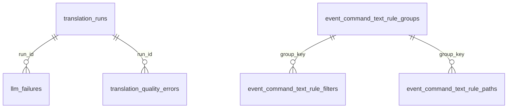

# 数据库 Wiki

本文档说明 A.T.T MZ 当前 SQLite 数据库结构。数据库只保存项目运行状态、规则和已保存译文记录；游戏原始数据仍以 RPG Maker MV/MZ 自身的 `data/*.json`、`js/plugins.js`、`fonts/gamefont.css` 等文件为准。

## 存放方式

- 每个游戏使用一个独立 SQLite 文件：`data/db/<游戏标题>.db`。
- 数据库文件名来自游戏标题。标题不能包含 Windows 文件名非法字符。
- `metadata` 表固定保存一条 `metadata_key = current_game` 的绑定记录。
- 数据库由 CLI 自动创建和维护。翻译任务、外部 Agent 和临时脚本不得直接改数据库，业务数据进出必须走 CLI。
- SQLite 可能自动生成 `sqlite_sequence` 内部表，用于自增主键；它不是项目业务表。

## 当前表总览

| 表名 | 职责 | 主要写入入口 |
|------|------|--------------|
| `metadata` | 保存当前数据库绑定的游戏目录、真实内容目录、引擎类型和版本 | `add-game` |
| `language_settings` | 保存当前游戏的源语言和目标语言 | `add-game` |
| `translation_items` | 保存已经通过项目检查的正文译文记录 | `translate`、`import-manual-translations` |
| `plugin_text_rules` | 保存插件配置中可翻译字符串的 JSONPath 规则 | `import-plugin-rules` |
| `note_tag_text_rules` | 保存 data 文件 Note 标签中可翻译标签名 | `import-note-tag-rules` |
| `event_command_text_rule_groups` | 保存事件指令文本规则组和事件指令编码 | `import-event-command-rules` |
| `event_command_text_rule_filters` | 保存事件指令规则组的参数匹配条件 | `import-event-command-rules` |
| `event_command_text_rule_paths` | 保存事件指令规则组的可翻译参数路径 | `import-event-command-rules` |
| `terminology_terms` | 保存字段译名表，例如地图名、数据库名称和系统类型译名 | `import-terminology` |
| `terminology_glossary_terms` | 保存正文翻译提示词使用的正文术语表 | `import-terminology` |
| `terminology_import_state` | 标记术语表已经导入，用来区分“空术语表”和“从未导入” | `import-terminology` |
| `placeholder_rules` | 保存当前游戏专用的自定义控制符保护规则 | `import-placeholder-rules` |
| `source_residual_rules` | 保存允许保留源语言片段的例外规则 | `import-source-residual-rules` |
| `font_replacement_records` | 保存最近一次字体覆盖产生的可还原字体引用记录 | `write-back --confirm-font-overwrite`、`write-terminology --confirm-font-overwrite` |
| `translation_runs` | 保存正文翻译运行状态和统计快照 | `translate` |
| `llm_failures` | 保存正文翻译运行中的模型故障记录 | `translate` |
| `translation_quality_errors` | 保存模型返回后未通过项目检查的译文问题 | `translate`、`quality-report` 相关流程 |

## 通用约定

- 所有文本字段按 UTF-8 处理。
- 字符串数组会序列化为 JSON 文本后存入 `TEXT` 字段，例如 `original_lines`、`source_line_paths`、`translation_lines`、`allowed_terms`、`error_detail`。
- `location_path` 是文本在游戏里的内部位置，只用于绑定导出、导入、质量检查和写回流程。面向用户说明时应说“文本在游戏里的内部位置”。
- `item_type` 当前取值为 `long_text`、`array`、`short_text`。
- `engine_kind` 当前取值为 `mv`、`mz`。
- 打开数据库时会校验关键字段。缺少当前 schema 必需字段时会直接报错，要求重新注册或执行独立数据迁移，不做静默猜测。

## CLI 与 Skill 对齐

- `add-game` 负责解析游戏布局，并把 `metadata` 的游戏目录、真实内容目录、引擎类型和版本写入数据库，同时把当前游戏源语言写入 `language_settings`。
- `list --json` 会展示 `game_title`、`game_path`、`content_root`、`engine_kind`、`engine_version`、`source_language`、`target_language` 和 `db_path`，用于快速确认已注册游戏是否绑定到正确内容目录和语言档案。
- `prepare-agent-workspace --json` 会在摘要和详情里展示引擎类型、引擎版本、真实内容目录、实际数据目录和当前源语言；外部 Agent 应以这个工作区输出为准。
- `export-event-commands-json` 未显式传入 `--code` 时，会按当前游戏引擎选择默认事件指令编码：MV 使用 `356`，MZ 使用 `357`。
- Skill 只要求 Agent 读取 CLI 输出和工作区文件，不要求也不允许 Agent 直接读取或修改数据库表。

## 表结构详情

### `metadata`

保存当前数据库绑定的游戏身份和布局信息。每个数据库只应有一行。

| 字段 | 类型 | 约束 | 说明 |
|------|------|------|------|
| `metadata_key` | `TEXT` | 主键 | 固定为 `current_game` |
| `game_title` | `TEXT` | 非空 | 游戏标题，也是数据库文件名来源 |
| `game_path` | `TEXT` | 非空 | 用户传入的游戏目录 |
| `engine_kind` | `TEXT` | 非空 | `mv` 或 `mz` |
| `content_root` | `TEXT` | 非空 | 真实游戏内容目录，根布局通常等于游戏目录，MV 部署布局通常是 `<游戏目录>/www` |
| `engine_version` | `TEXT` | 非空 | 从核心脚本识别到的引擎版本，无法识别时保存 `unknown` |

维护规则：

- `add-game` 会重新解析游戏布局并覆盖当前记录。
- 数据库文件名对应的游戏标题必须和 `metadata.game_title` 一致。
- 旧库若缺少 `engine_kind`、`content_root` 或 `engine_version`，当前代码会拒绝打开。

### `language_settings`

保存当前游戏使用的语言档案。每个数据库只应有一行。

| 字段 | 类型 | 约束 | 说明 |
|------|------|------|------|
| `settings_key` | `TEXT` | 主键 | 固定为 `current` |
| `source_language` | `TEXT` | 非空 | 源语言，当前支持 `ja` 或 `en` |
| `target_language` | `TEXT` | 非空 | 目标语言，当前固定为 `zh-Hans` |

维护规则：

- `add-game --source-language ja|en` 会覆盖当前语言档案；源语言参数必须显式传入。
- 项目不做自动语言检测，注册前必须确认当前游戏是日文还是英文。
- 缺少语言档案时当前代码会拒绝打开数据库；旧库需要通过独立迁移脚本先写入语言设置。

### `translation_items`

保存已经通过项目检查、可以写回游戏的正文译文。

| 字段 | 类型 | 约束 | 说明 |
|------|------|------|------|
| `location_path` | `TEXT` | 主键 | 文本在游戏里的内部位置 |
| `item_type` | `TEXT` | 非空 | `long_text`、`array` 或 `short_text` |
| `role` | `TEXT` | 可空 | 说话人或上下文角色，无法确定时为空 |
| `original_lines` | `TEXT` | 非空 | JSON 字符串数组，保存原文行 |
| `source_line_paths` | `TEXT` | 非空 | JSON 字符串数组，保存原文行对应的内部来源 |
| `translation_lines` | `TEXT` | 非空 | JSON 字符串数组，保存中文译文行 |

维护规则：

- `translate` 和 `import-manual-translations` 会写入这张表。
- `write-back` 只读取已经保存且仍属于当前提取范围的译文。
- `reset-translations` 会按路径或当前提取范围删除记录，让文本重新进入翻译流程。

### `plugin_text_rules`

保存 `js/plugins.js` 中经过校验的插件文本路径规则。

| 字段 | 类型 | 约束 | 说明 |
|------|------|------|------|
| `plugin_index` | `INTEGER` | 联合主键 | 插件在 `$plugins` 数组中的下标 |
| `plugin_name` | `TEXT` | 非空 | 插件名称 |
| `plugin_hash` | `TEXT` | 非空 | 插件配置哈希，用于发现规则和当前插件配置不匹配 |
| `path_template` | `TEXT` | 联合主键 | 指向可翻译字符串叶子的 JSONPath 模板 |

维护规则：

- `import-plugin-rules` 先按插件下标定位，再校验插件名称、计算插件哈希并检查路径命中，最后整体替换此表内容。
- 主翻译流程只按数据库中已导入的规则提取插件文本。

### `note_tag_text_rules`

保存 data 文件 `note` 字段中可翻译的标签名。

| 字段 | 类型 | 约束 | 说明 |
|------|------|------|------|
| `file_name` | `TEXT` | 联合主键 | data 文件名或文件模式 |
| `tag_name` | `TEXT` | 联合主键 | 可翻译 Note 标签名 |

维护规则：

- `import-note-tag-rules` 校验标签在候选范围内后整体替换此表内容。
- 没有导入的 Note 标签不会进入正文翻译。

### `event_command_text_rule_groups`

保存事件指令参数文本规则的分组主表。

| 字段 | 类型 | 约束 | 说明 |
|------|------|------|------|
| `group_key` | `TEXT` | 主键 | 根据事件指令编码和参数过滤条件生成的稳定组键 |
| `command_code` | `INTEGER` | 非空 | 事件指令编码，例如 MV 插件命令 `356`、MZ 插件命令 `357` |

维护规则：

- `import-event-command-rules` 整体替换事件指令规则三张表。
- `event_command_text_rule_filters` 和 `event_command_text_rule_paths` 通过 `group_key` 关联此表。

### `event_command_text_rule_filters`

保存事件指令规则组的参数匹配条件。

| 字段 | 类型 | 约束 | 说明 |
|------|------|------|------|
| `group_key` | `TEXT` | 联合主键，外键 | 关联 `event_command_text_rule_groups.group_key` |
| `parameter_index` | `INTEGER` | 联合主键 | 要匹配的参数下标 |
| `parameter_value` | `TEXT` | 非空 | 参数必须等于的字符串值 |

维护规则：

- 规则组删除时，过滤条件通过外键级联删除。
- 空过滤条件表示只按事件指令编码匹配。

### `event_command_text_rule_paths`

保存事件指令规则组中的可翻译参数路径。

| 字段 | 类型 | 约束 | 说明 |
|------|------|------|------|
| `group_key` | `TEXT` | 联合主键，外键 | 关联 `event_command_text_rule_groups.group_key` |
| `path_template` | `TEXT` | 联合主键 | 指向可翻译字符串叶子的 JSONPath 模板 |

维护规则：

- 规则组删除时，路径通过外键级联删除。
- 导入时必须显式声明事件指令编码，业务代码不会按固定编码猜测复杂插件参数文本。

### `terminology_terms`

保存字段译名表。它负责写回稳定字段，例如地图显示名、数据库名称、系统类型，以及 MZ 标准名字框等。MV 的说话人术语也会保存在 `speaker_names` 中，但只用于术语统一和正文翻译提示词命中，不写回游戏文件。

| 字段 | 类型 | 约束 | 说明 |
|------|------|------|------|
| `category` | `TEXT` | 联合主键 | 术语类别 |
| `source_text` | `TEXT` | 联合主键 | 原文术语 |
| `translated_text` | `TEXT` | 非空 | 标准中文译名 |

当前术语类别：

`speaker_names`、`map_display_names`、`actor_names`、`actor_nicknames`、`class_names`、`skill_names`、`item_names`、`weapon_names`、`armor_names`、`enemy_names`、`state_names`、`system_elements`、`system_skill_types`、`system_weapon_types`、`system_armor_types`、`system_equip_types`。

维护规则：

- `import-terminology` 会整体替换此表内容。
- 空字段译名表也会通过 `terminology_import_state` 标记为已导入。
- MV 标准 `101` 通常没有第 5 个名字框参数，不能为了写入说话人而补齐字段。
- MV 的 `speaker_names` 来源于每个对话块首条非空 `401` 正文识别出的说话人；它不是可写回字段，只服务术语表和正文翻译上下文。

### `terminology_glossary_terms`

保存正文翻译提示词使用的正文术语表。

| 字段 | 类型 | 约束 | 说明 |
|------|------|------|------|
| `source_text` | `TEXT` | 主键 | 原文术语 |
| `translated_text` | `TEXT` | 非空 | 标准中文译名 |

维护规则：

- `import-terminology` 会整体替换此表内容。
- 它只服务正文翻译提示词命中，不负责直接写回游戏字段。

### `terminology_import_state`

标记术语表导入状态，用于区分“已经导入空术语表”和“从未导入术语表”。

| 字段 | 类型 | 约束 | 说明 |
|------|------|------|------|
| `state_key` | `TEXT` | 主键 | 固定为 `current` |
| `imported` | `INTEGER` | 非空 | 当前为 `1` 表示术语表已导入 |

维护规则：

- 字段译名表或正文术语表为空时，也会写入状态记录。
- 读取术语表时，如果术语表为空但存在状态记录，会返回空术语表对象。

### `placeholder_rules`

保存当前游戏专用的自定义控制符保护规则。

| 字段 | 类型 | 约束 | 说明 |
|------|------|------|------|
| `pattern_text` | `TEXT` | 主键 | 正则表达式字符串 |
| `placeholder_template` | `TEXT` | 非空 | 自定义占位符模板，例如 `[CUSTOM_NAME_{index}]` |

维护规则：

- `import-placeholder-rules` 会整体替换此表内容。
- 自定义规则必须先通过 `validate-placeholder-rules` 和覆盖扫描，避免把普通换行、正文或其他合法内容误判为游戏控制符。

### `source_residual_rules`

保存允许保留源语言片段的例外规则。对外 CLI 使用 `source-residual` 命令。

| 字段 | 类型 | 约束 | 说明 |
|------|------|------|------|
| `location_path` | `TEXT` | 主键 | 文本在游戏里的内部位置 |
| `allowed_terms` | `TEXT` | 非空 | JSON 字符串数组，允许保留的源语言片段 |
| `reason` | `TEXT` | 非空 | 保留原因 |

维护规则：

- `import-source-residual-rules` 会整体替换此表内容。
- `import-source-residual-rules` 是唯一的源文保留例外导入入口，日文和英文游戏共用同一套流程。
- 例外规则只用于确需保留的片段，不能用来掩盖整句漏翻。

### `font_replacement_records`

保存最近一次字体覆盖产生的可还原字体引用记录。

| 字段 | 类型 | 约束 | 说明 |
|------|------|------|------|
| `file_name` | `TEXT` | 联合主键 | 被替换引用所在文件，例如 data 文件、`plugins.js` 或 `fonts/gamefont.css` |
| `value_path` | `TEXT` | 联合主键 | 被替换字段在文件里的内部路径 |
| `original_text` | `TEXT` | 非空 | 覆盖前的字体引用 |
| `replaced_text` | `TEXT` | 非空 | 覆盖后的字体引用 |
| `replacement_font_name` | `TEXT` | 非空 | 候选覆盖字体文件名 |

维护规则：

- 字体覆盖只在用户明确允许时执行。
- 新一轮字体覆盖会整体替换这张表。
- `restore-font` 使用此表和配置中的候选字体名判断需要还原哪些新字体引用；还原完成后会清空记录。

### `translation_runs`

保存正文翻译运行状态和统计快照。

| 字段 | 类型 | 约束 | 说明 |
|------|------|------|------|
| `run_id` | `TEXT` | 主键 | 本次翻译编号 |
| `status` | `TEXT` | 非空 | 运行状态 |
| `total_extracted` | `INTEGER` | 非空 | 当前提取到的正文条目数量 |
| `pending_count` | `INTEGER` | 非空 | 运行开始时还没成功保存译文的文本数量 |
| `deduplicated_count` | `INTEGER` | 非空 | 相同原文合并后的待请求数量 |
| `batch_count` | `INTEGER` | 非空 | 计划发送给模型的批次数 |
| `success_count` | `INTEGER` | 非空 | 成功保存的译文数量 |
| `quality_error_count` | `INTEGER` | 非空 | 模型翻了但项目检查没通过的译文数量 |
| `llm_failure_count` | `INTEGER` | 非空 | 模型运行故障数量 |
| `started_at` | `TEXT` | 非空 | 开始时间 |
| `updated_at` | `TEXT` | 非空 | 更新时间 |
| `finished_at` | `TEXT` | 可空 | 结束时间 |
| `stop_reason` | `TEXT` | 非空 | 停止原因 |
| `last_error` | `TEXT` | 非空 | 最近一次错误摘要 |

当前状态取值：

`running`、`completed`、`blocked`、`cancelled`、`failed`、`stopped`。

维护规则：

- `translate` 启动时创建新记录，并在运行中持续更新。
- 新运行开始时会清空上一轮 `translation_quality_errors`。

### `llm_failures`

保存指定翻译运行里的模型故障记录。

| 字段 | 类型 | 约束 | 说明 |
|------|------|------|------|
| `failure_id` | `INTEGER` | 主键，自增 | 模型故障记录 ID |
| `run_id` | `TEXT` | 非空，外键 | 关联 `translation_runs.run_id` |
| `category` | `TEXT` | 非空 | 故障分类 |
| `error_type` | `TEXT` | 非空 | 错误类型 |
| `error_message` | `TEXT` | 非空 | 错误摘要 |
| `retryable` | `INTEGER` | 非空 | `1` 表示可重试，`0` 表示不可重试 |
| `attempt_count` | `INTEGER` | 非空 | 发生故障时的尝试次数 |
| `created_at` | `TEXT` | 非空 | 创建时间 |

当前故障分类：

`rate_limit`、`timeout`、`connection`、`server`、`conflict`、`fatal`、`unknown`。

维护规则：

- 删除对应 `translation_runs` 记录时会级联删除模型故障记录。
- 质量报告会读取最新运行的模型故障，并决定是否提示继续处理。

### `translation_quality_errors`

保存模型返回后未通过项目检查的译文问题。

| 字段 | 类型 | 约束 | 说明 |
|------|------|------|------|
| `run_id` | `TEXT` | 联合主键，外键 | 关联 `translation_runs.run_id` |
| `location_path` | `TEXT` | 联合主键 | 文本在游戏里的内部位置 |
| `item_type` | `TEXT` | 非空 | `long_text`、`array` 或 `short_text` |
| `role` | `TEXT` | 可空 | 说话人或上下文角色 |
| `original_lines` | `TEXT` | 非空 | JSON 字符串数组，原文行 |
| `translation_lines` | `TEXT` | 非空 | JSON 字符串数组，模型返回的译文行 |
| `error_type` | `TEXT` | 非空 | 检查错误类型 |
| `error_detail` | `TEXT` | 非空 | JSON 字符串数组，错误明细 |
| `model_response` | `TEXT` | 非空 | 模型原始返回文本 |

当前错误类型：

`模型返回不可解析`、`AI漏翻`、`文本结构不匹配`、`控制符不匹配`、`源文残留`、`选项行数不匹配`。

维护规则：

- 删除对应 `translation_runs` 记录时会级联删除质量问题记录。
- 手动修复并导入成功后，会按文本内部位置清理对应问题。
- `write-back` 前必须确认当前质量报告没有阻止写回的问题。

## 关联关系

其他表通过业务流程关联，不依赖数据库外键。例如 `translation_items.location_path`、`source_residual_rules.location_path` 和 `translation_quality_errors.location_path` 都使用同一种文本内部位置字符串，但数据库层不强制建立外键。

## 维护规则

- 新增表或字段时，先更新 `app/persistence/sql.py` 和读写仓库，再补测试，最后同步本文档。
- 需要迁移已有数据库文件时，写一次性脚本处理；确认完成后删除脚本，不把一次性兼容迁移逻辑留在正式代码路径里。
- 外部 Agent 不直接读写数据库。需要规则、术语或译文时，通过 CLI 导出 JSON，修改后再走 validate/import 命令。
- 文档示例只能使用 `<游戏标题>`、`<游戏目录>`、`<游戏内容目录>` 等占位符，不能写入真实本机路径或真实样本名。
