# 模块解释图

这份文件同时保存图片版解释图和 Mermaid 可维护图。图片版适合快速理解模块边界，Mermaid 版适合后续随着代码演进直接修改。

## 0. 图片版模块图

这些图片已经复制到 `docs/images/modules/`，文件名按模块固定，避免引用随机生成文件名。

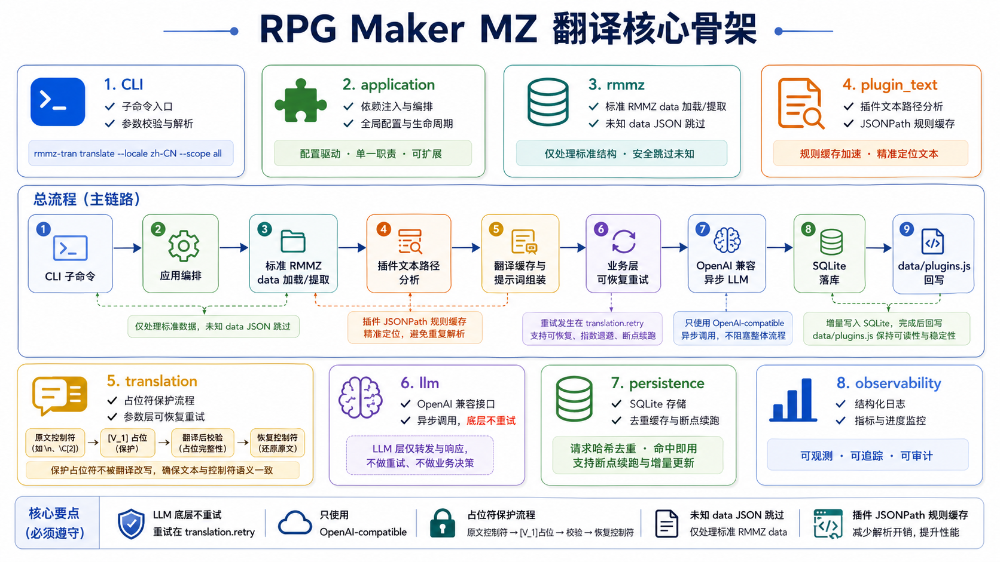

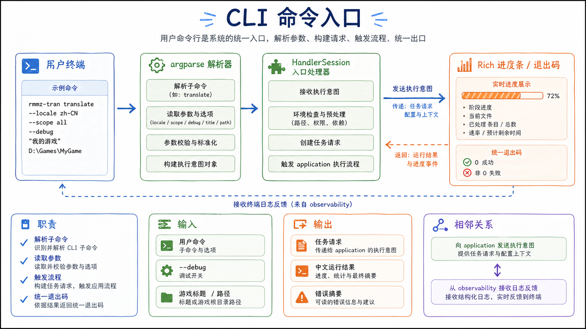

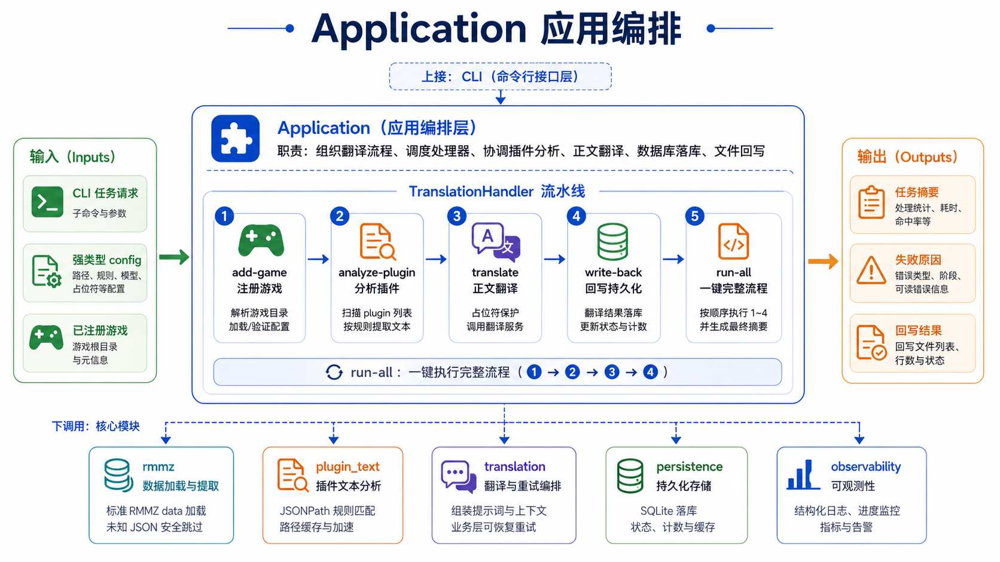

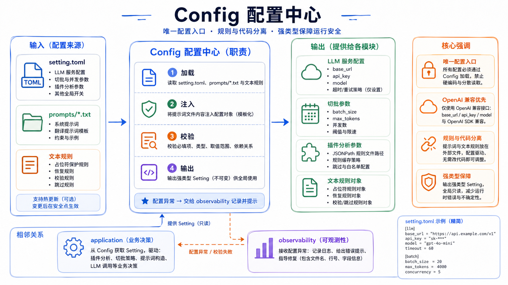

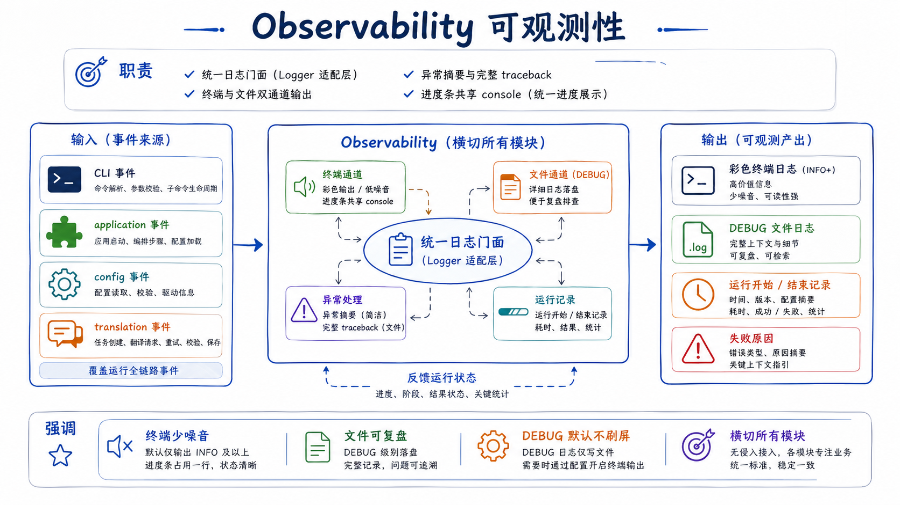

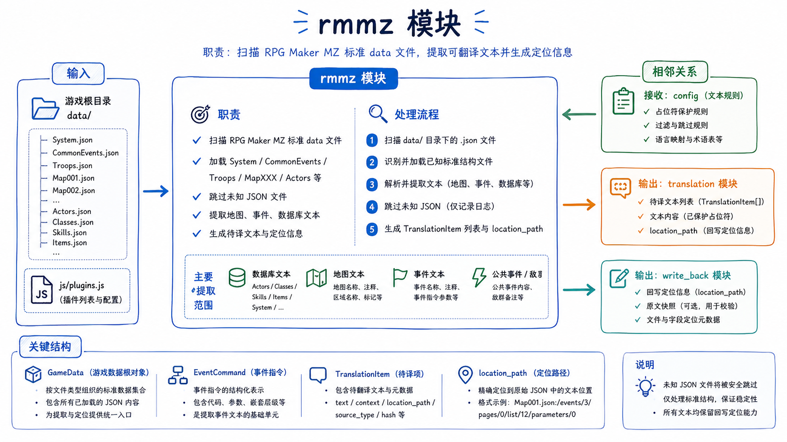

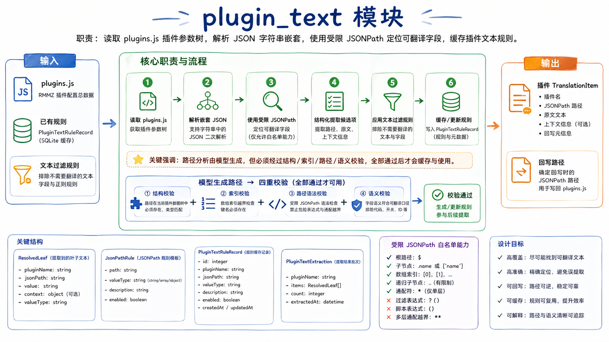

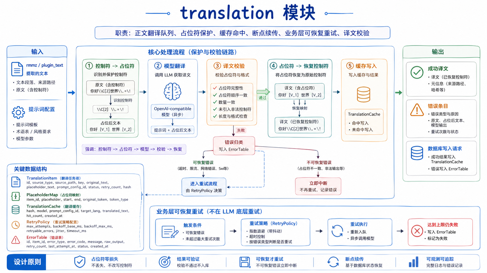

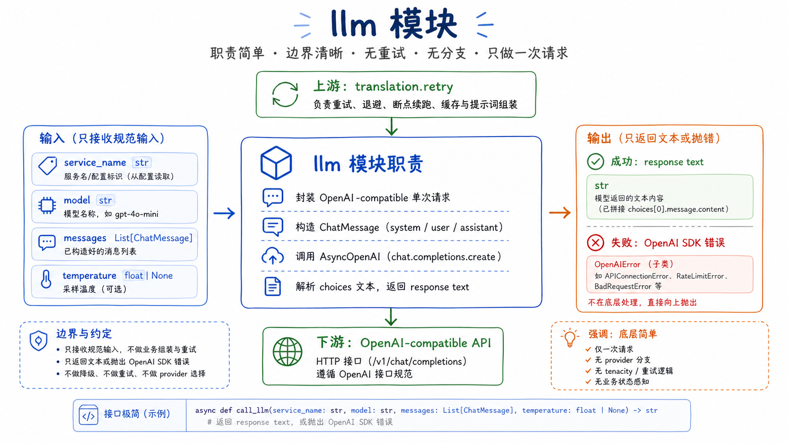

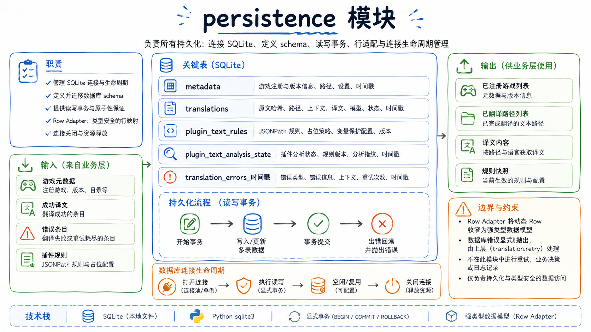

## 1. 总流程图

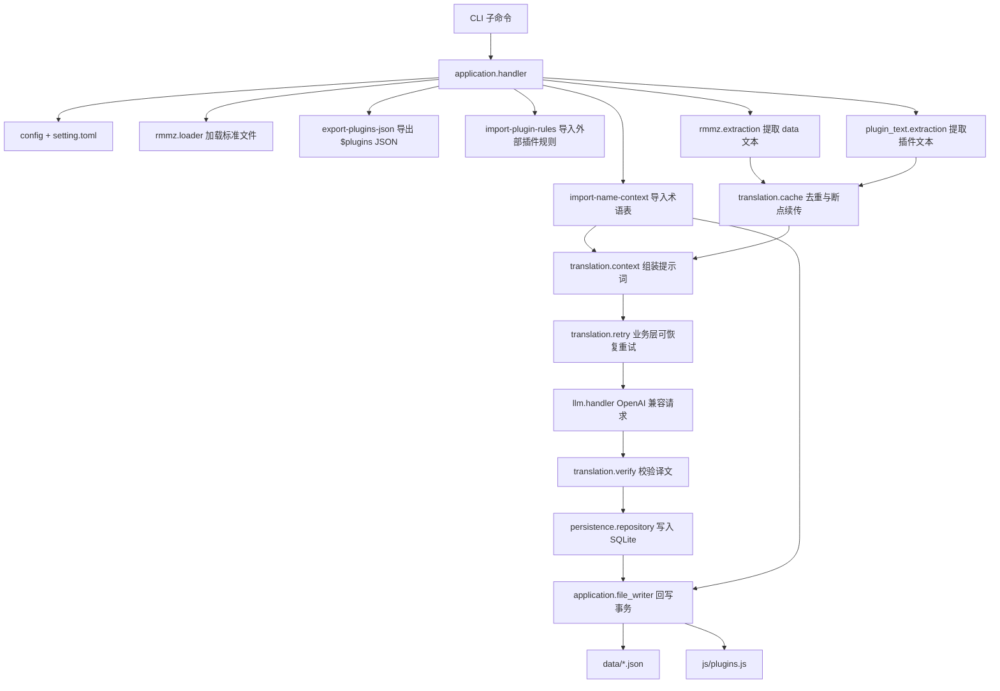

## 2. LLM 与重试边界

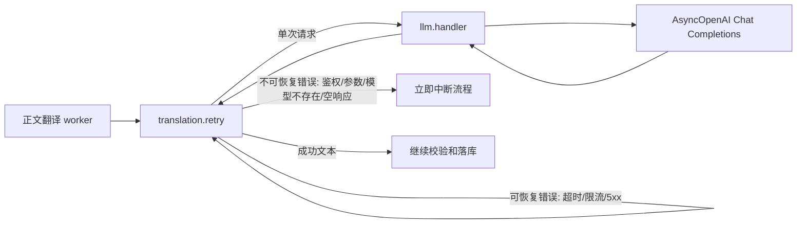

## 3. 标准 data 文本提取

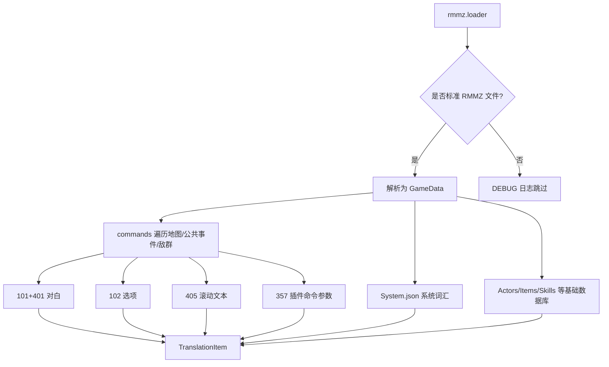

## 4. 占位符保护流程

```mermaid
flowchart LR
    Original[原文: こんにちは\\V[1]%12\\G] --> Build[build_placeholders]
    Build --> Masked[送模文本: こんにちは[V_1][P_12][G_0]]
    Masked --> Model[模型翻译]
    Model --> Returned[译文: 你好[V_1][P_12][G_0]]
    Returned --> Verify[verify_placeholders 数量校验]
    Verify --> Restore[restore_placeholders]
    Restore --> Final[最终译文: 你好\\V[1]%12\\G]
```

## 5. 插件文本外部规则导入

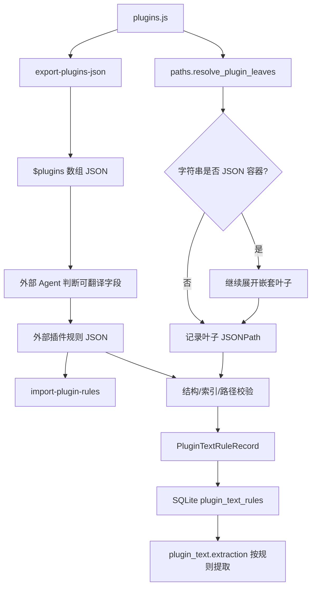

## 6. 数据库与回写

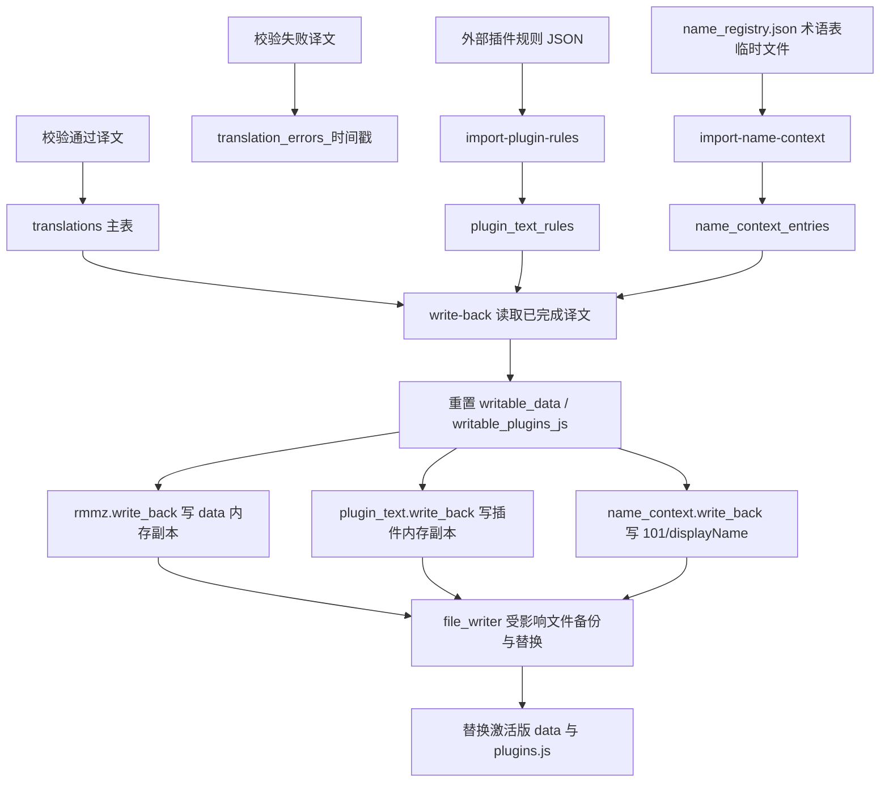
